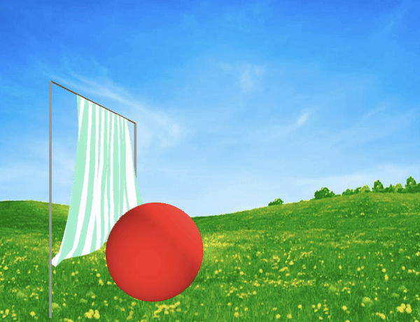

# Cloth Simulation
### Code used to create a cloth simulation.

## Summary
The code included in this repo is used to create a system of multiple threads interacting with eachother, resulting in a cloth simulation. Specifically, this cloth simulation includes a striped sheet hanging on a "clothesline" of sorts. In addition, there is a large user-controlled red ball, which can be used to further demonstrate the cloth-like behavior of the sheet.

## Dependecies and Usage
Processing is needed to run this code.

Once Processing has been downloaded, the simulation can be started by running `ClothSimulation.pde`.  
**Note:** A background image of a field is included in a 'data' folder.

### Vector Operation Library
In addition to the main simulation files, a vector operation class is included for all vector related calculations performed.

## Red Ball Interaction
Like mentioned, a large red ball is included in the scene to better demonstate the cloth-like behavior of the sheet. 
Once the simulation is running, using the '<' and '>' keys, (i.e. ',' and '.') the user can move the red ball forward and backwards, showing the cloth-ball interaction.

## Result

